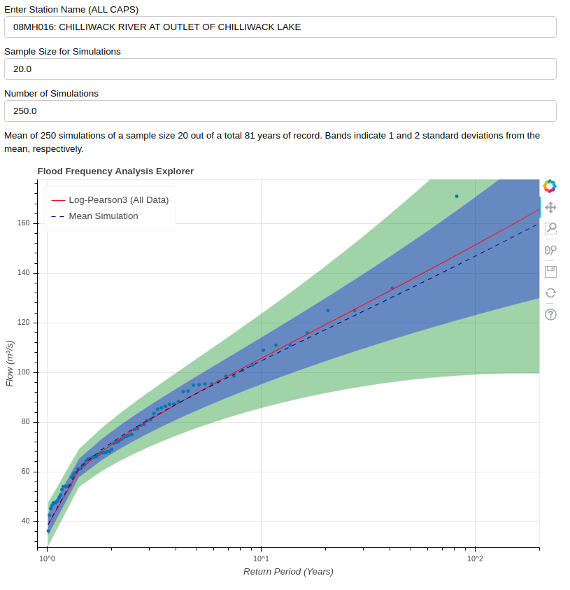

# Flood Frequency Explorer

An interactive application to explore the concept of uncertainty in flood estimation.

## Description

Flood Frequency Analysis (FFA) is common practice for hydrologists to estimate flood magnitude.  A typical method of estimating a return period flood uses the annual peak  instantaneous flow series as an input, fitting a statistical distribution to the data (typically GEV, LPIII, etc.) and then extrapolating beyond the data, where there is considerable uncertainty.

A dataset of sufficient length to capture the true distribution of annual floods does not exist.  As a result, practitioners have limited sample sizes to work with, and analysis is then sensitive to sampling variability.  Further, the fragile assumption of non-stationarity founds the basic FFA methodology on soggy ground (nice).

## Basic Methodology

Fitting a Log-Pearson type 3 distribution to the full set of annual maximum peak instantaneous flow events yields a continuous estimate of the underlying distribution (solid red line).

Assuming the set of annual instantaneous floods is comprised of statistically independent events, we can select a subset of size N (without replacement) of events from the total record at random.  Fitting a Log-Pearson type 3 distribution to the subset, we get some other continuous estimate of the distribution.  The smaller the subset, the poorer we expect the subset to reflect reality.  Again, because the individual events are assumed to be statistically independent, we then run the simulation M times.

Taking the results of each of the M simulations of N samples of the population, the mean and standard deviation of all of the distribution fits are calculated for a 'continuous' range of return periods from 1.01 to 200 years.  The shaded blue region represents 1 standard deviation from the mean, while the green region represents 2 standard deviations from the mean.

The interpretation of the blue and green regions is something like, *If I had a limited record of N years upon which to base a flood estimate, I can expect the mean of the distribution for some longer period to be within the illustrated range of uncertainty, given the data.*

## Further Thoughts

* practically speaking, in designing a structure, we choose some design life
  * can we work backwards and find an expected design life or uncertainty given the length of dataset upon which a distribution is built?
* how do distributions change over time as data are added?
  * can we make some comparison between the length of record we have to work with and either some desired design life or some observation about how the appropriateness of the estimate changes over time?
* Can we make some generalization about the ratio of the subset length to the total data length, where the subset length is related to the record length we have, while the design life is related to the total data length?
* **I could also make it so that the selection of a subset can be done interactively with a box select or lasso tool?**

## Getting Started

### Dependencies

This application is developed on Ubuntu 18.

Package requirements include:

* numpy
* pandas
* scipy
* [Bokeh](https://bokeh.pydata.org/en/latest/index.html)
* requests
* wget

### Installing

1. Clone the repo from github
    >`git clone https://github.com/dankovacek/flood_frequency`

2. CD into the directory
    >`cd flood_frequency`

3. Create a development environment with virtualenv (or use conda)
    >`virtualenv -p python3 env`

4. Activate the development environment
    >`source env/bin/activate`

5. Install the required packages (or use Conda and install the dependencies listed above)
    >`pip install -r requirements.txt`

6. Download the hydat database file from EC.
    >`python download.py`

7. Check the path to the database file in `get_station_data.py`.

>  The path to the database directory is set at the top of `get_station_data.py` where the `DB_DIR` variable is set.  If you used the `download.py` function to download the database, follow the instructions at the top of `get_station_data.py`.  Otherwise, set the database file path however you want to organize your file structure.  

### Executing program

1. From the root directory, execute:
    >`bokeh serve .`

Note the address that the local Bokeh server launches, indicated in the terminal.

Typically, the address is:

>`http://localhost:5006/flood_freq`

## Help

You're on your own for now...

## Authors

[Dan Kovacek](https://github.com/dankovacek)

## Version History

* 0.1
  * Initial Release

## License

This project is licensed under the MIT License - see the LICENSE.md file for details

## Acknowledgments

The Bokeh visualization library:

* [Bokeh](https://https://bokeh.org/)
